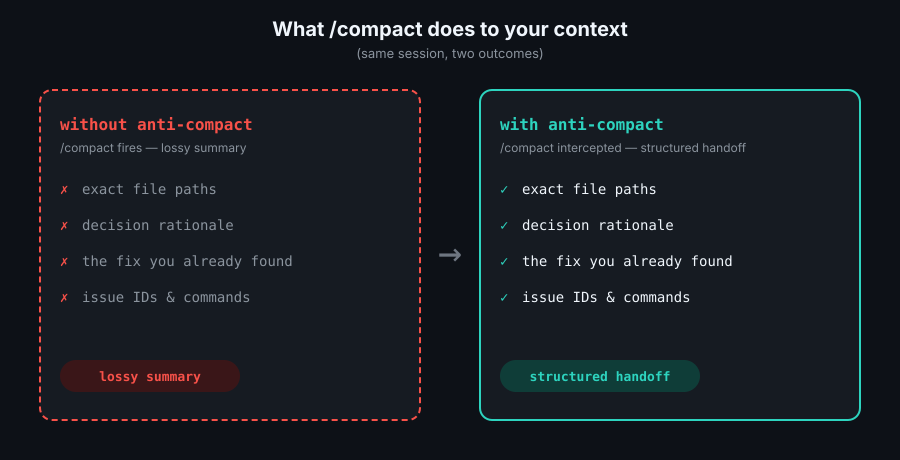
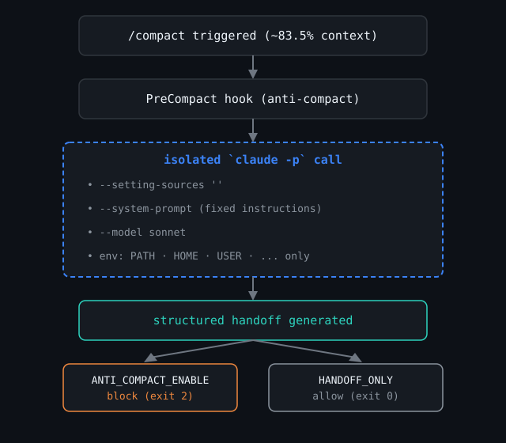

<picture>
  <source media="(prefers-color-scheme: dark)" srcset="assets/logo-dark.svg">
  <source media="(prefers-color-scheme: light)" srcset="assets/logo-light.svg">
  
</picture>

[](LICENSE)
[](https://claude.ai/code)
[](https://discord.gg/Fjc9zYHZyV)

> Keep the part that mattered.

A Claude Code plugin that intercepts `/compact` and generates a structured session handoff instead of letting Claude discard your context.

> [!NOTE]
> Backed by Anthropic's own guidance on context: models are trained to track and use their remaining context precisely — but response quality degrades well before that budget runs out. See [context awareness in Claude's prompting best practices](https://platform.claude.com/docs/en/build-with-claude/prompt-engineering/claude-prompting-best-practices#context-awareness-and-multi-window-workflows) and [Effective harnesses for long-running agents](https://www.anthropic.com/engineering/effective-harnesses-for-long-running-agents).


[Install](#install) · [Usage](#usage) · [How It Works](#how-it-works)

## The Problem

Claude Code's `/compact` command frees up context window space by summarizing your session and discarding the rest. It fires automatically once your context fills up (~83.5% by default) — no warning, no confirmation. The summary is lossy: exact file paths, the reasoning behind a decision, the fix you already found for a tricky bug — all of it can vanish into a paragraph of prose.

You've felt this: deep into a debugging session, root cause finally identified, fix half-written — then `/compact` fires. The new summary knows *that* you were debugging auth, but not the one-line fix you'd already found. You re-derive it from scratch.



## How It Works

anti-compact intercepts Claude Code's `PreCompact` hook, generates a structured handoff through an isolated `claude -p` call, and either blocks the lossy compaction or lets it proceed — depending on which mode you've enabled.



See [docs/how-it-works.md](docs/how-it-works.md) for the full technical breakdown — transcript parsing, token estimation, subprocess isolation, and fallback behavior.

## Scenarios

**Auto-interception** — `/compact` fires mid-session, anti-compact catches it, blocks it, and hands you a structured continuation prompt instead:

```
$ # ...three hours into a migration...
⚠ context window at 83.5% — anti-compact intercepted /compact
# [anti-compact] Pre-Compact Handoff
...
```

**On-demand handoff** — before a natural break, generate a handoff without waiting for auto-compact:

```
/anti-compact:handoff
```

**Resume in a new session** — paste the handoff into a fresh session and continue with full context, no re-deriving anything:

```
$ claude
> [paste the handoff prompt]
```

## Case Study

Want to see the difference yourself? [case-study.md](case-study.md) walks through a reproducible before/after in under 5 minutes — no special setup beyond Claude Code itself.

## Install

Inside a Claude Code session:

```
/plugin marketplace add joeblackwaslike/agent-marketplace
/plugin install anti-compact@agent-marketplace
```

Or from a shell:

```bash
claude plugin marketplace add joeblackwaslike/agent-marketplace
claude plugin install anti-compact@agent-marketplace
```

Restart your session for the plugin to take effect.

## Usage

### Generate a handoff on demand

```
/anti-compact:handoff
```

Generates a handoff for the current session and displays it in a fenced block ready to paste.

### Enable automatic interception

```
/anti-compact:handoff auto
```

or

```
/anti-compact:handoff on
```

From now on, every `/compact` call is intercepted — a handoff is generated and compaction is blocked.

### Disable automatic interception

```
/anti-compact:handoff off
```

`/compact` returns to normal behavior.

## Requirements

- Node.js >= 22.5
- Claude Code with `claude` available in PATH (used to generate the handoff)

## Tuning

By default, Claude Code auto-compacts at ~83.5% context — well past where response quality starts to degrade. `CLAUDE_AUTOCOMPACT_PCT_OVERRIDE=65` is a reasonable starting point that leaves real working room while triggering before quality drops. See [docs/how-it-works.md#tuning-when-it-fires](docs/how-it-works.md#tuning-when-it-fires) for the full rationale and how to set it.

## Limitations

- The `claude -p` handoff call typically takes 20–40 seconds, against a 45s internal timeout and a 60s hook timeout.
- Token estimates are approximate (`chars ÷ 4`), not exact counts.
- Claude Code only — Gemini CLI and Codex don't have a `PreCompact` hook equivalent.

Full details in [docs/how-it-works.md#limitations](docs/how-it-works.md#limitations).

## Roadmap

- [ ] Reduce `claude -p` handoff latency
- [ ] Replace the `chars / 4` token estimate with a real tokenizer
- [ ] Evaluate Gemini CLI / Codex equivalents for `PreCompact`
- [ ] Improve `claude` binary discovery beyond PATH + the hardcoded nvm fallback

Tracked in [docs/_backlog.md](docs/_backlog.md).

## License

MIT — see [LICENSE](LICENSE).
